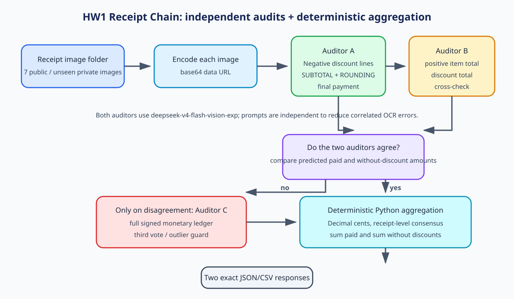

# FTEC5660 Homework 1: Receipt Chain

Build a LangChain pipeline that reads every supermarket receipt in a folder
with the vision-capable DeepSeek Flash model and answers these two questions:

1. How much money did I spend in total for these bills?
2. How much would I have had to pay without the discount?

For this homework, **amount spent** means the final payment after the receipt's
rounding line. **Without the discount** means the sum of the original positive
item prices: add back every promotion, coupon, member, app, packaging-damage,
and percentage discount, but do not add back rounding.

## Student task

Only edit the two functions in `hw1.py` that contain `### YOUR CODE HERE`:

- `build_chain()` creates your LangChain chain.
- `answer_queries()` runs the chain on the receipt images and returns one final
  response for each question.

You may use prompt chaining, routing, parallel calls, reflection, or a
combination. Your final responses should each contain one HKD amount. Do not
hard-code filenames or public answers; grading uses unseen receipt folders.

## Setup and public test

```bash
python3 -m venv .venv
source .venv/bin/activate
pip install -r requirements.txt
```

Put your DeepSeek key after `DEEPSEEK_API_KEY=` in `.env`, then run:

```bash
python3 hw1.py --image-folder public_test
```

The program creates `results.csv` in the current directory. Its columns are
`query`, `model_response`, and `correctness`. The public answers are in
`public_test/ground_truth.json`. The starter intentionally returns the dummy
response `please design your chain to answer these two queries.` so it runs
before you add any API code.

The required model is `deepseek-v4-flash-vision-exp`, the vision-capable
DeepSeek Flash model. JPEG, PNG, GIF, and WebP inputs are accepted by the
homework runner.


## Homework 1 solution



### Design

The solution uses `deepseek-v4-flash-vision-exp` through LangChain as a receipt-auditing pipeline. Each image is encoded as a data URL and passed to two independent vision prompts in parallel: one audits every negative discount line before `SUBTOTAL`, while the other reconstructs the positive item/charge total and independently checks it against `SUBTOTAL` plus the discount total. The receipt-level results are compared in Python; if the two auditors disagree, a third ledger-audit prompt transcribes every signed monetary line and acts as a tie-breaker. Python then applies an outlier guard (the discount total must be between zero and the printed subtotal), resolves each receipt by consensus, converts all amounts to `Decimal` cents, and sums the receipt-level paid amounts and without-discount amounts before returning the two exact query strings and one HKD amount each.

### Public-test verification

The implementation was run end-to-end three times from the required command:

```bash
python3 hw1.py --image-folder public_test
```

| Run | Query 1 | Query 2 | Result |
|---|---|---|---|
| 1 | `HK$1974.30` | `HK$2348.20` | correct / correct |
| 2 | `HK$1974.30` | `HK$2348.20` | correct / correct |
| 3 | `HK$1974.30` | `HK$2348.20` | correct / correct |

This gives 100% query accuracy on the seven public receipts across the three verification runs. The implementation does not hard-code filenames or public answers; all values are extracted from the supplied images and aggregated at runtime.

